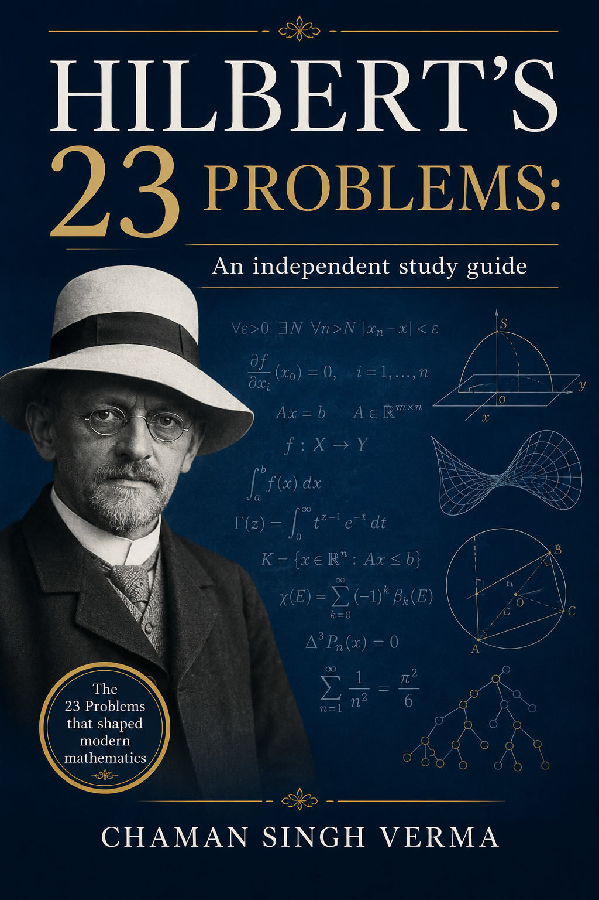

# Hilbert's 23 Problems — An Independent Study Guide



A LaTeX book introducing Hilbert's 23 problems at the undergraduate level.

## Objectives

- **Introduce all 23 problems** in modern mathematical language, one per chapter, with historical context and current status.
- **Remain accessible** to undergraduates with calculus, basic linear algebra, and mathematical maturity — no graduate prerequisites assumed.
- **Emphasize ideas over machinery** — each chapter explains the core concepts without requiring the full technical apparatus of the field.
- **Provide self-contained chapters** — readers can skip around freely; each chapter includes a problem statement, key developments, FAQs, and exercises.
- **Serve as a roadmap** to deeper study, with appendices for timeline, glossary, notation, and further reading.

## Build

```sh
make        # produces hilbert_book.pdf (3-pass pdflatex)
make clean  # removes auxiliary files
```

## Contents

- 23 problem chapters + introduction + retrospective
- 4 appendices (timeline, glossary, notation, further reading)
- Prerequisite table, FAQs per chapter, exercises
- ~274 pages, 0 errors on build

## Structure

```
hilbert_book.tex          — main document (preamble, includes)
chapters/                 — 25 chapter files
appendices/               — timeline, glossary, notation, further-reading
frontpage.png             — cover image
Makefile                  — build automation
```

## License

All rights reserved.
